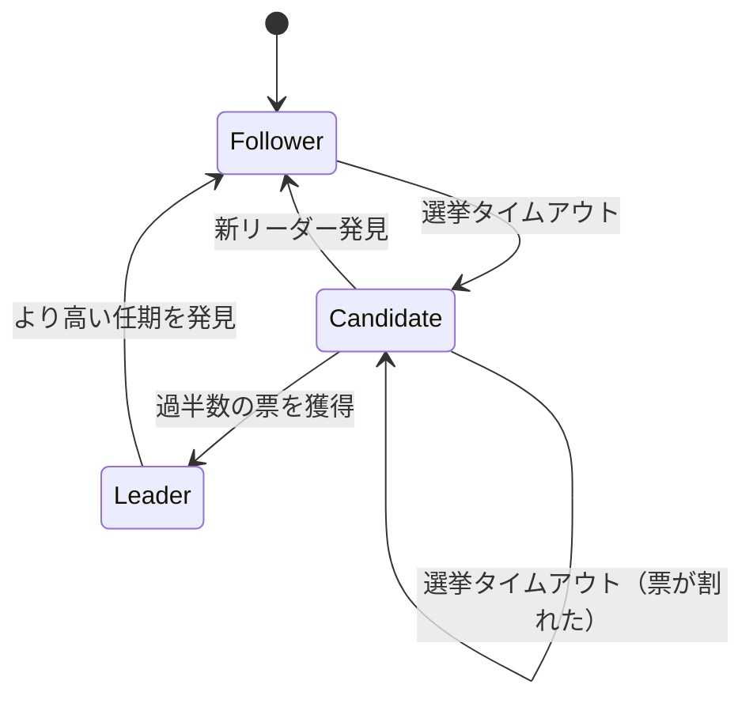

# Raft 合意アルゴリズム Go実装

分散システムにおける合意アルゴリズム「Raft」のGo言語による実装です。

> **Note**
> この実装は個人の学習目的で作成したものです

## 概要

Raftは、分散システムにおいて複数のノードが同じ状態を維持するための合意アルゴリズムです。Paxosより理解しやすいことを目標に設計されました。

### 主な特徴

- **リーダー選挙**: クラスタ内で1つのリーダーを選出
- **ログ複製**: リーダーがコマンドを全ノードに複製
- **安全性**: 過半数のノードが生存していれば動作継続

## プロジェクト構成

```
raft/
├── cmd/                    # エントリーポイント（デモ）
│   └── main.go
├── pkg/
│   ├── raft/               # Raftコアロジック
│   │   ├── state.go        # ノード状態（Follower/Candidate/Leader）
│   │   ├── config.go       # 設定（タイムアウト値など）
│   │   ├── log.go          # ログ管理
│   │   ├── node.go         # ノード本体（選挙・ハートビート）
│   │   ├── handlers.go     # RPC受信ハンドラ
│   │   └── cluster.go      # クラスタ管理ユーティリティ
│   └── rpc/                # RPC関連
│       ├── messages.go     # RPC型定義
│       └── transport.go    # 通信層インターフェース
├── go.mod
└── README.md
```

## クイックスタート

### 実行方法

```bash
go run ./cmd
```

### 出力例

```
===========================================
    Raft 合意アルゴリズム デモ
===========================================

Raftクラスタを起動中（5ノード）...
リーダー選出を待機中...

--- 初期状態 ---
ノード0: 状態=フォロワー, 任期=1, ログ長=0, コミット済み=0 [実行中]
ノード1: 状態=フォロワー, 任期=1, ログ長=0, コミット済み=0 [実行中]
ノード2: 状態=リーダー, 任期=1, ログ長=0, コミット済み=0 [実行中] ★
ノード3: 状態=フォロワー, 任期=1, ログ長=0, コミット済み=0 [実行中]
ノード4: 状態=フォロワー, 任期=1, ログ長=0, コミット済み=0 [実行中]
```

## Raftアルゴリズムの基本概念

### 3つのノード状態

| 状態 | 説明 |
|------|------|
| **Follower** | 受動的にリーダーからの指示を待つ |
| **Candidate** | リーダーになろうと選挙を行う |
| **Leader** | クラスタを統率し、ログを複製する |



**選挙タイムアウト**: フォロワーがリーダーからのハートビートを一定時間受信できなかった場合に発生。
タイムアウト値は150〜300msの範囲でランダムに設定され、複数ノードが同時に選挙を開始することを防ぐ。

### 任期（Term）

- 論理的な時間の単位
- 各任期で最大1人のリーダー
- より高い任期を見たノードは即座にフォロワーに戻る

### 2つのRPC

#### 1. RequestVote（投票リクエスト）

候補者がリーダーになるために他ノードに投票を求める。

```go
type RequestVoteArgs struct {
    Term         int  // 候補者の任期
    CandidateID  int  // 候補者のID
    LastLogIndex int  // 最後のログインデックス
    LastLogTerm  int  // 最後のログの任期
}
```

#### 2. AppendEntries（ログ追加/ハートビート）

リーダーがログを複製し、存在を通知する。

```go
type AppendEntriesArgs struct {
    Term         int        // リーダーの任期
    LeaderID     int        // リーダーのID
    PrevLogIndex int        // 直前のログインデックス
    PrevLogTerm  int        // 直前のログの任期
    Entries      []LogEntry // 追加するエントリ
    LeaderCommit int        // リーダーのコミットインデックス
}
```

## 使用方法

### 基本的な使い方

```go
package main

import (
    "github.com/example/raft/pkg/raft"
    "github.com/example/raft/pkg/rpc"
)

func main() {
    // トランスポート層を作成
    transport := rpc.NewInMemoryTransport()

    // クラスタを作成（5ノード）
    cluster := raft.NewCluster(5, transport, nil)

    // 各ノードをトランスポートに登録
    for _, node := range cluster.GetNodes() {
        transport.RegisterNode(node)
    }

    // クラスタを起動
    cluster.Start()

    // リーダーを取得してコマンドを提案
    leader := cluster.GetLeader()
    if leader != nil {
        leader.Propose("SET key value")
    }

    // クラスタを停止
    cluster.Stop()
}
```

### 設定のカスタマイズ

```go
config := &raft.Config{
    // 選挙タイムアウト: リーダーからのハートビートが途絶えた際に
    // フォロワーが候補者に移行するまでの待ち時間（ランダムに選択される範囲）
    ElectionTimeoutMin: 150 * time.Millisecond,
    ElectionTimeoutMax: 300 * time.Millisecond,

    // ハートビート間隔: リーダーがフォロワーに生存を通知する間隔
    // 選挙タイムアウトより十分短くする必要がある
    HeartbeatInterval:  50 * time.Millisecond,
}

cluster := raft.NewCluster(5, transport, config)
```

## 実装の詳細

### パッケージの責務

| パッケージ | 責務 |
|-----------|------|
| `pkg/raft` | Raftアルゴリズムのコアロジック |
| `pkg/rpc` | RPC型定義と通信抽象化 |
| `cmd/raft` | デモアプリケーション |

### 主要な構造体

#### Node（ノード）

```go
type Node struct {
    // 永続化される状態
    currentTerm int        // 現在の任期
    votedFor    int        // 投票先
    log         *Log       // ログエントリ

    // 揮発性の状態
    commitIndex int        // コミット済みインデックス
    lastApplied int        // 適用済みインデックス

    // リーダーのみ
    nextIndex   map[int]int  // 次に送るインデックス
    matchIndex  map[int]int  // 複製済みインデックス
}
```

#### Log（ログ）

```go
type Log struct {
    entries []LogEntry
}

type LogEntry struct {
    Term    int         // 作成された任期
    Index   int         // ログ内の位置
    Command interface{} // コマンド
}
```

## 参考資料

- [Raft論文](https://raft.github.io/raft.pdf) - "In Search of an Understandable Consensus Algorithm"
- [Raft可視化](https://raft.github.io/) - インタラクティブな可視化
- [etcd/raft](https://github.com/etcd-io/raft) - 本番環境向け実装
